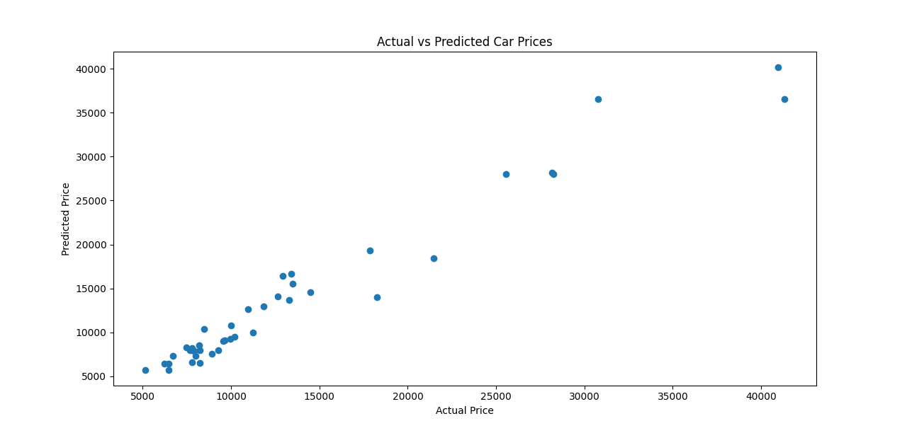
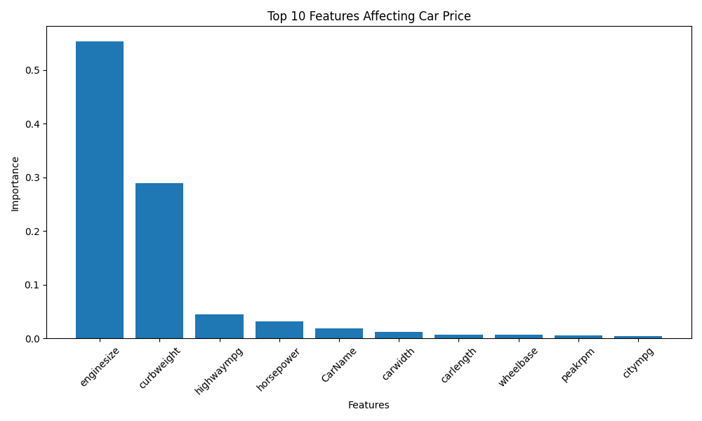

# 🚗 Car Price Prediction using Machine Learning

## 📌 Project Overview

This project predicts car prices using Machine Learning based on various vehicle specifications such as engine size, horsepower, fuel type, mileage, and other technical features.

The objective is to build a regression model capable of estimating the market price of a car accurately.

---

## 🎯 Objective

* Analyze car features and their impact on vehicle prices.
* Perform data preprocessing and feature engineering.
* Train a Machine Learning model for price prediction.
* Evaluate model performance using regression metrics.

---

## 🛠 Technologies Used

* Python
* Pandas
* NumPy
* Matplotlib
* Scikit-learn

---

## 📊 Dataset Information

The dataset contains 205 car records and 26 features including:

* Car Name
* Fuel Type
* Aspiration
* Car Body
* Drive Wheel
* Engine Type
* Engine Size
* Horsepower
* Peak RPM
* City MPG
* Highway MPG
* Price (Target Variable)

---

## ⚙️ Machine Learning Workflow

### 1. Data Preprocessing

* Removed unnecessary columns.
* Encoded categorical variables using Label Encoding.
* Prepared data for model training.

### 2. Train-Test Split

* Training Data: 80%
* Testing Data: 20%

### 3. Model Training

* Random Forest Regressor
* 100 Estimators
* Random State = 42

### 4. Model Evaluation

The model was evaluated using:

* Mean Absolute Error (MAE)
* Mean Squared Error (MSE)
* R² Score

---

## 📈 Results

| Metric   | Value      |
| -------- | ---------- |
| MAE      | 1307.67    |
| MSE      | 3522224.16 |
| R² Score | 0.955      |

### Interpretation

The model achieved an **R² Score of 0.955**, indicating that it explains approximately **95.5% of the variation in car prices**, demonstrating excellent predictive performance.

---

## 🔍 Top Features Affecting Car Price

1. Engine Size
2. Curb Weight
3. Highway MPG
4. Horsepower
5. Car Name

These features had the greatest influence on the predicted vehicle price.

---

## 📷 Project Output

### Actual vs Predicted Car Prices

### Feature Importance

---

## 🚀 Conclusion

This project successfully demonstrates the use of Machine Learning for real-world price prediction problems. The Random Forest Regressor achieved high accuracy and identified the most influential factors affecting vehicle prices.

---

## 👩‍💻 Author

**Rupsha Mishra**

CodeAlpha Data Science Internship Project
